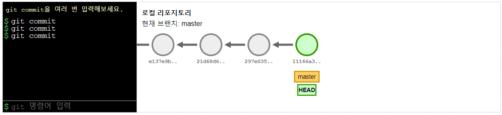
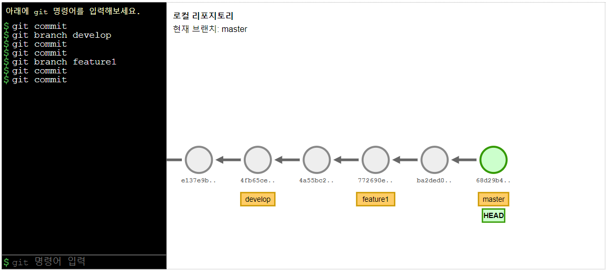
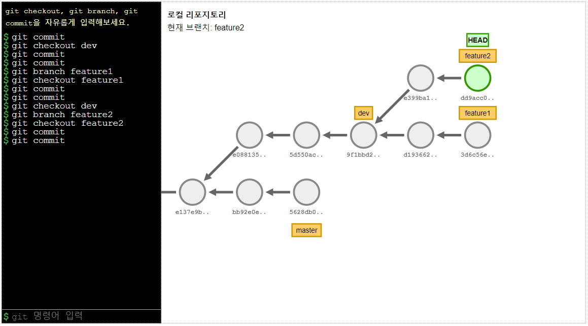
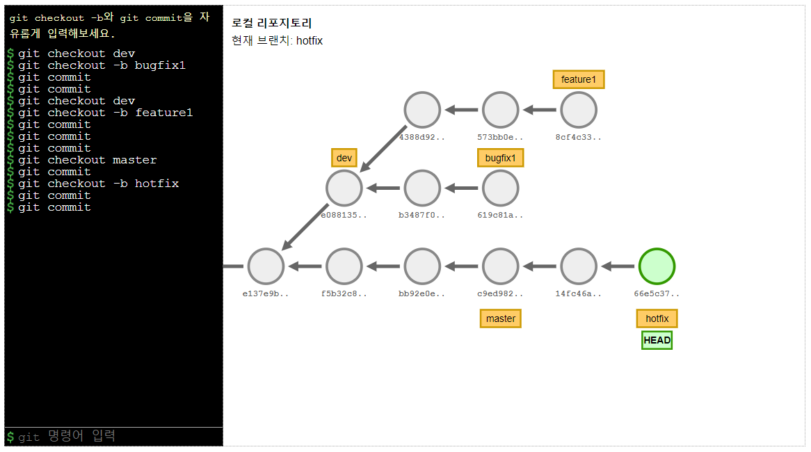
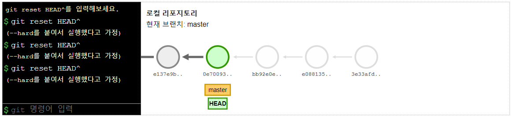

# git 튜토리얼

[git 튜토리얼](https://violet-bora-lee.github.io/git-tutorial/)은 git 명령어를 입력 했을 때 어떤 변화가 생기는지 시각적으로 보여주면서 git을 학습할 수 있도록 만든 튜토리얼입니다.

## git commit

## git branch

## git checkout

## git checkout -b

## git reset
